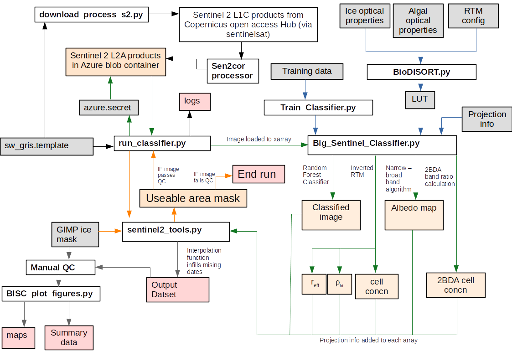
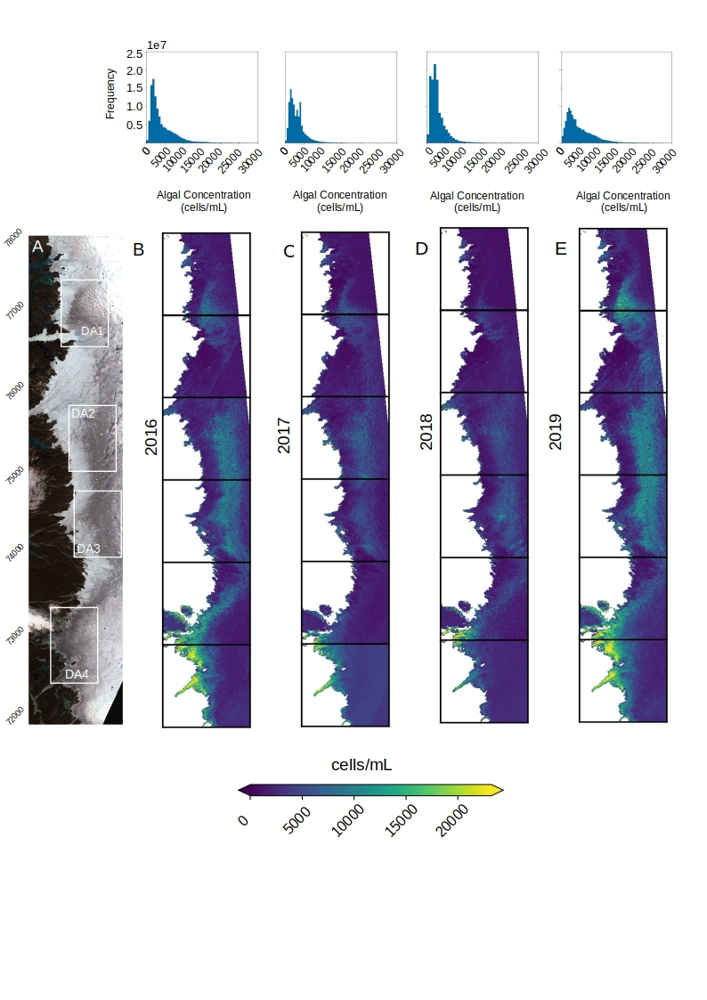

# RISA: Remote Ice Surface Analyser

This repository contains code for automated downloading, processing, analysis and visualizing of Sentinel-2 data for the Greenland Dark Zone. For a user-defined tile and date range, the script will download the imagery, reproject and apply an atmospheric correction, and then for each pixel predict a discrete surface type using a random forest classifier trained on field spectroscopy data, invert a radiative transfer model to retrieve ice grain size, density and light absorbing impurity concentrations, and calculate the surface albedo. Additional scripts are provided for generating summary statistics and plotting maps for each parameter.

This code is controlled using a .template file that is pre-configured for the south-west Greenland Ice Sheet between 65-70N. This area is contained within the following five tiles:

22WEA, 22WEB, 22WEC, 22WET, 22WEU, 22WEV

Imagery is downloaded from a MS Azure blob container populated with Sentinel-2 level-2A products for Jun-August 2016-2019. To extend this to more recent dates the code must either be linked to a different image repository or the image downloading and processing scripts provided here used to add more imagery to the existing blob container.

## Model Overview



The schematic above shows the main flows between mdel components. Rectangles with white backgrounds are scripts that do some data processing or transformation. Rectangles with light grey backgrounds are input data. Rectangles with orange backgrounds are intermediate data products. Retangles with red backgrounds are model outputs. Arrows indicate flow of data from one component to the next. I have tried to loosely colour code to make it easier to follow and isolate sub-loops within the main model structure.

## Setup

### Hardware

The computational requirements of this script vary depending upon which functions are toggled on/off. We have been tried to keep as much of the processing out of memory as possible, only loading arrays when unavoidable. We have also made extensive use of Dask for distributing the work over the available processing cores, so significant acceleration will be experienced when this software is run of machines with more available cores. We have been using a Microsoft Azure Linux Data Science Machine with 72 processing cores (ID = Fs72). The cost for this virtual machine is ~£3/hour. On the Fs72 VM it takes just over 21 hours to process 1 year's worth of imagery (6 tiles, JJA, all processing options toggled ON, including uploading results to blob storage). Once the main processing had been achieved we continued to use an Azure VM for the data analysis but since we had less need for large multi-core processing we resized to a 16 core E16s which cost ~90p/hour. Maintaining a smaller VM rather than doing the data analysis locally was preferred because of much easier and faster access to the large amount of output data (2.4 TB) stored remotely in Azure storage blobs. By far the most time consuming step in the pipeline is the uploading of output data to blob storage, the slowest part of the actual processing pipeline is the radiative transfer model inversion.

### Environment

We used Ubuntu 16.04 on a Microsoft Azure F72 Linux Data Science Machine with 128 GB RAM. Our code was written in Python 3.5 via Anaconda 4.5.11 and developed using VSCode 1.29.1. Our Python environment can be replicated as follows: 

    conda create -n IceSurfClassifier -c conda-forge python ipython xarray scikit-learn gdal georaster gdal seaborn rasterio matplotlib
    pip install azure sklearn-xarray sentinelsat dask

or alternatively Ubuntu 16.04 users can configure the environment from environment.yaml using:

    conda env -f environment.yml

In this case the environment name is set in the first line of the yml file. Beware of the prefix in the final line of the file - this will need to be updated or deleted depending on the installation.

### Environment variables

The classifier requires several environment variables to be set:

* `AZURE_SECRET`: full path to file holding Azure secret information
* `CSCIHUB_SECRET`: full path to file holding Copernicus SciHub secret information
* `PROCESS_DIR`
* `SEN2COR_BIN` : e.g. `~/Sen2Cor-02.05.05-Linux64/bin/`

The two "secret" variables are paths to files containing the account keys for the azure blob storage and Copernicus Sentinelsat APIs. These files can be located anywhere on your system and preferably outside the repository (although the `.gitignore` file is set to ignore `.secret` files to reduce the risk of these files being committed accidentally). 
 
Create a file to hold Azure secret information, e.g. `.azure_secret`, with format:

    [account]
    user=
    key=

And for Copernicus SciHub:
    
    [account]
    user=
    password=

Create your `PROCESS_DIR`, e.g. `/scratch/RISA/`. The `PROCESS_DIR` is the folder where temporary files, images and eventually the output data are stored. The pickled classifier and mask should also be saved to the `PROCESS_DIR` in advance of running the classifier script.

The simplest way to set these environment variables is to use a shell script. An example, `setup_classifier.sh`, has been provided with this repository. Make a copy that you can modify to suit your environment. The copy should not be committed back to this repository.

With a shell script created to set these environment variables, execute `source setup_classifier.sh` in the terminal in which you plan to run the classifier. The variables will be available for the duration of the session. 

### Template

The user-defined variable values are all defined in a template file (e.g.  `swgris.template`). This is where the main script grabs values to configure the image downloading, processing, classification and reporting.

The user should enter their desired values into the template file prior to running the classifier. Multiple templates can be saved and called along with the classifier.

#### Template Variables:

Options:

1) vm: this is a Boolean toggled True if the code is run on an Azure VM or local machine. This is relevant because different paths are used on each machine. This currently mostly affects the image_interpolator() function in sentinel2_tools.py because that function uses the positions of certain characters in the filepaths to extract dates to interpolate between. This could be improved in future by replacing the positional character extraction by using regex or string matching, this would make the code more portable and insensitive to running on different machines.
2) tiles: this is a comma-separated list of the tile IDs to process
3) years: this is a comma separated list of the years to include. Note that because of a quirk of how the data is collated, only one year can be processed per run, i.e. use separate runs for each year of interest)
4) months: this is a comma-separated list of the months to include
5) classifier: this is the file name for the pickled sklearn classifier to use
6) icemask: this is the file name for the ice mask to use
7) resolution: the desired resolution of the sentinel 2 imagery
8) savefigs: now redundant option to toggle figure saving on/off
9) retrieve_disort_params: toggle to control whether the RTM inversion function is run. If true, grain size, density, algal concentration, dust concentration are included in the output data, if not they are absent.
10) interpolate_cloud: toggle to control whether pixels obscured by cloud are interpolated over to give continuous data across the icy part of the image
11) interpolate_missing_tiles: toggle to control whether missing dates are infilled by linear interpolation between "good" dates
12) calculate_melt: toggle to control whether melt rates are calculated pixelwise across the image area. This is off by default because although the eb modelling works, elevation and meterological input valus are currently held constant, which is of limited value.
13) downsample_outdata: toggle to determine whether to include edaily data, or to reduce the temporal resolution to save memory
14) outData_resolution: provide an integer to determine the temporal resolution, in days, of the outData
15) remove_individual_files: toggle to determine whether, after the collated data file is created, the individual files used are discarded to kept
16) upload_to_blob: toggle to control whether the output datasets are uploaded to Azure blob storage and deleted from the local disk. This can be slow depending upon internet upload speed and file size (1 tile, 1 month = ~30 GB)
    

Thresholds:

1) minArea: integer to determine the minimum amount of the total image area that should be covered by ice (as opposed to tundra, ocean etc) for the image to be deemed acceptable quality to proceedwith analysis
2) cloudCoverThresh: integer to define the minimum probability of a pixel being obscured by cloud - if the probability is greater than this value, the pixel will be considered cloudy and interpolated over if interpolate_cloud is toggled on, or left as NaN if interpolate_cloud is toggled off. If the probability is less than this threshold, the pixel is considered clear and used in the analysis.

netcdf:
author: author information to be used as attributes in the outdata netCDFs
title: file title to be used as attribute data in the outData netCDFs
predicted_legend: text labels for each numerically labelled class (e.g. "Snow:1; Water:2; Cryoconite:3; Clean Ice:4; Light Algae:5; Heavy Algae:6")


### Directory Structure

The directories should be arranged as follows. It is critical that this structure is maintained else paths will fail.

```
Remote Ice Surface Explorer
|
|----- run_classifier.py
|----- Ice_Surface_Analyser.py
|----- RISA_param_Log.txt
|----- RISA_plot_figures.py
|----- download_process_s2.py
|----- ebmodel.py
|----- environment.yml
|----- README.md
|----- sentinel2_azure.py
|----- sentinel2_tools.py
|----- setup_classifier.sh
|----- xr_cf_conventions.py
|----- swgris.template
|----- .azure_secret
|----- .cscihub_secret
|
|-----RISA_OUT  (this directory is for output data)
|           |
|           |---will be populated with .nc and .csv files
|           |
|           |---Figures_and_Tables
|                   |
|                   |---will be populated with outputs
|
|
|-----Process_Dir
|           |
|           |---ICE_MASK.nc
|           |---merged_mask.tif
|           |---Sentinel2_classifier.pkl
|           |---SNICAR_LUT_2058.npy
|           |---will be populated with band images and auto-flushed at end of run
|           |
|            Outputs
|               |
|               |
|              Tile
|               |
|               |
|               |---To be populated with output data
|
|
```

## Downloading and pre-processing S2 imagery

To obtain the necessary Sentinel-2 imagery, we have provided a script download_process_s2.py. This requires the user to have an active Copernicus Open Data Hub account and the username and password should be stored in csci.secret in PROCESS_DIR. The desired tile and date range is defined in the template file (in our case swgris.template). The user can then run:

```
python download_process_s2.py swgris.template

```
This will trigger a batch download of the relevant files and automatically apply the Sen2Cor processor for atmospheric correction, georectification and reprojection. The necessary files from the L2A product are then extracted and uploaded to Azure blob storage (the user must define their azure storage account in a .secret file) while the rest of the L2A files and the original L1C files are all deleted. When the processing script is run, it retrieves the necessary files from the Azure blob containers.

Note that since August 2019 any Sentinel-2 imagery older than 18 months is no longer immediately available from Copernicus and instead they are held in a long term storage repository called the LTA (long term archive). A request for a file in the LTA triggers the retrieval of the file server-side, making it available for later download. The process of retrieving the files from LTA can take between minutes and hours and they remain available for 3 days. This means download_process_s2.py will sometimes fail, but it will trigger the release of files from LTA, so the fix is simply to run it again later, possibly a few times, until the files are available for download.

Also, note that the downloading sometimes fails on multi-month runs. I have not been able to diagnose why exactly this occurs but becaue the program does not crash or return any exceptions, it simply hangs at the end of each month, I suspect the issue is server-side. The workaround is to download one month's worth of imagery at a time.

## How to run

Once the desired imagery has been downloaded, processed and stored in an Azure container, the next step is running the classification, albedo, snicar retrieval and spatial/temporal interpolation algorithms. These are configured by altering the template file.

Before you begin, make sure you have created a `template` file containing the settings for your desired workflow, and that you have set the environment variables needed by the workflow (see 'Setup' above).

If you have created the suggested bash shell script, then simply run:

    source setup_classifier.sh

To start the main program, run 

`python run_classifier.py <template.template>`.

The configuration details will automatically be saved to a text file (RISA_Param_Log.txt). A list of the tile/date combinations that are discarded due to QC flags or download errors are saved to csv files (aborted_downloads.csv, rejected_by_qc.csv) and so is a list of all tile/date combinations successfully analysed (good_tiles.csv). Output data will automatically upload to Azure storage containers (see "Outputs" below).

After the main script has run and the output data has been generates, some manual running of scripts is required to reformat the output data and generate summary statistics and maps. This begns with running the file "data_reducer.py". This script separates the large "FULL_OUTPUT...nc" files into individual variables that are easier to manage. The same script also discards dates that did not pass a manual quality control. The resulting reduced datasets are saved in the RISA_OUT folder and are used to generate the maps and summary statistics.

The analysis and plotting are achieved using the script "RISA_plot_figures.py". There are several functions in that script that can be called with user defined variables for generating the various maps, plots and summary datasets.

There are also additional scripts provided that enable model validation and other associated analyses, including comparisons between modelled and measured cell concentrations (FieldSpectra_LUT_comparison.py) and for building the spectral lookup table (LUTbuilder.py, must be run as part of separate repository bioDISORTpy).

## Example Outputs



The maps, histograms and colorbar in the above figure are all outputs from RISA_plot_figures.py. They have been collated and organised into a single figure manually using illustration software. Subplot A shows a true-colour composite of the SW GrIS with some particularly low albedo areas marked. Subplot B shows the summer-mean algal cell concentration predicted using the inverted RTM for 2016, 2017, 2018 and 2019. The histograms show the frequency distribution of algal cell concentrations in individual pixels across the area shown in A and B.

## Functionality

### Classification

The classifier assigns one of 6 surface type labels to each pixel. This is achieved using a random forest classifier trained on field spectroscopy data and validated using multispectral imagery acquired from a UAV flown over the surface of the Greenland Ice Sheet in summer 2017 and 2018. See Cook et al. (2020): Glacier algae accelerate melting on the SW Greenland Ice Sheet, The Cryosphere (https://doi.org/10.5194/tc-14-309-2020). This repository includes a new model trained on an updated spectral database with spectra collected on Foxfonna, Svalbard in summer 2019 following the fiels spectroscopy protocols described in Cook et al. (2017, 2020).

### Albedo

Surface albedo is calculated using Liang et al's (2000) narrowband to broadband conversion which was originally formulated for LANDSAT but validated for Sentinel-2 by Naegeli et al. (2017).

### RTM retrievals

There is an option in the template file to retrieve ice surface parameters using an inverted radiative transfer model (BioDISORT which uses a Python interface modelled after BioSNICAR_GO from Cook et al. 2020: https://doi.org/10.5194/tc-14-309-2020) to run the radiatve transfer model DISORT. 

BioDISORTpy can be found in a separate repository here: www.github.com/jmcook1186/bioDISORTpy. This was used to construct the LUTs that are found here and used in the inverted RTM.

If the inverted RTM is toggled ON in the template, then the spectral reflectance in each pixel of the S2 tile is compared to a lookup table of 2244 BioDISORT-generated spectra. There are multiple LUTs generated using different solar zenith angles. The appropriate LUT is selected by comparison to the solar zenith angle at the time of aquisition for the S2 image calculated from the site coordinates, date and time from the image metadata. The DISORT parameters (grain size, density, algae concentration) used to generate the closest-matching spectra (measured as absolute error) are assigned to that pixel, producing maps of ice physical properties and light absorbing particle concentrations. Dust is not quantified because a) previous research indicates that it is insignificant as a driver of surface albedo, b) initial tests indicated that dust was taking effectively random values rather than being a significant controlling variable for the spectral albedo.

Note that despite the LUT approach, the RTM inversion is computatonally expensive and would ideally be run on some HPC resource. We are using a Microsoft Azure F72 Linux Data Science Machine with 72 cores to distribute the processing, which enables the retrieval function to complete in about 7 minutes per tile. Increasing the size of the LUT increases the computation time. Currently the LUT comprises 2400 individual simulated spectra, produced by running snicar with all possible combinations of 6 grain sizes, 5 densities, 8 dust concentrations and 10 algal concentrations. 


Note also that predictions for cell concentrations are ouput in ppb (=ng/g). To convert this to cell concentration in cells/mL, I suggest the following (used in upcoming publication):

1. Calculate cell volume from empirical measurements

    the mean radius and length for glacier algal cells from Cook et al. (2020) was 4um and 40 um respectively. Therefore, use pi*r^2*l to calculate cell volume
    
2. Calculate per-cell mass from volume and density

    the cell density is taken from the literature to be 1400 kg/m3 which is
    0.0014 ng/um3. Then multiply by  1 - water fraction to get dry mass. There is uncertainty around this value and past studies have ranged from 0.5 - 0.8. I used it as a tuning parameter bound by those literature values and found 0.7 to be optimal for reducing the error between measured and predicted concentrations. This gives dry weight per cell, which I calculate to be 0.84 ng.

3. Use per-cell dry mass to calculate cells/mL from ppb
   
    ppb is equal to ng/g. The mass of ice per mL is 0.917g. Therefore divide the value in ppb by the reciprocal of 0.917 and multiply by a constant C that accounts for the algae being in the upper 1mm of ice whereas field measurements have a vertical resolution of 1-2cm (C=10)

Therefore, to get cells/mL:

cells/mL = ppb / (((((PI() * 4^2) * 40)* 0.0014)*0.3) /0.917) *10)


### 2DBA Band ratio index and prediction

If the DISORT inversion is toggled ON, the 2DBA band ratio index and prediction is calculated by default. The 2DBA index was proposed by Wang et al (2018) for biomass quantification. It is the ratio between reflectance in Sentinel 2 bands 5 / band 4. The ratio for each pixel is saved as the 2DBA index (the layer name in the output dataset is "Index2DBA"). Wang et al. also proposed an exponential equation for converting index value into biomass concentration in cells/mL:

cells/mL = 10^-35 * 2DBAIndex exp^(87.015*2DBAIndex)

This is applied piwelwise and the predicted biomass concentration in cells/mL according to the Wang et al. (2018) method is saved as a separate layer in the output dataset, named "predict2DBA". This enables direct comparison between the biomass quantification estimated using the band ratio technique and the biomass quantification estimated using the inverse RTM.


### Missing pixel interpolation

Images where pixels have been masked out using the CloudMask (the sensivity of which is controlled by the user-defined variable cloudCoverThreshold) can have those pixels infilled using 2D nearest neighbour interpolation by toggling the "interpolate_cloud" option in the template. However, this is very slow, and as an alternative, the cloudy pixels can be infilled using the layer median. The median-infill is the version used in the current version to make the code run in an acceptable amount of time.

### Missing date interpolation

There is an option to toggle interpolation on/off. If interpolation is toggled on, the script will use pixel-wise linear interpolation to generate synthetic datasets for each missing date in the time series. Dates may be missing from the time series sue to a lack of overpass or a data quality issue such as excessive cloud cover. The interpolation function identifies these missing tiles, then identifies the most recent and nearest future dates where a valid dataset was acquired. It then applies a point-to-point linear regression between the values in each pixel in the past image and the corresponding pixel in the future image. The pixel values are then predicted using the regression equation for the missing dates. Recommend also scanning through the images manually after interpolation because occasionally interpolating pixels that were cloud-free in the past and cloudy in the future or vice versa can lead to unrealistic interpolation results. Anomalous dates should be manually discarded or alternatively the interpolation function could be run as a standalone with "good" past and future tiles manually selected.


# Outputs

### Maps

A specific tile on a specific date has associated with it several variables of interest, including albedo, surface class, grain size, ice density, dust concentration, algae concentration. Each of these variables is mapped over a 5490 x 5490 pixel grid, as per the original Sentinel-2 image. Each of these variables is therefore stored as a 5490 x 5490 array of values. These are stored in an xarray dataset with common cartographic and georeferencing attributes, dimensions and coordinates but unique values. For ach individual tile. the values on each date are collated into a single large NetCDF file. These files are large - a single month for a single tile occupies ~ 30GB of memory - one summer's data for a single tile occupies ~90GB.

From April 2020, these data are optionally downsampled. By default this is to 3-day temporal resolution, but this can be changed easily in the template file. This was deemed to be an acceptable trade-off between memory requirements and resolution. Five tiles can be analysed over 5 years of the Sentinel-2 record in 750GB of storage space using the 3-day resolution, whereas 1-day resolution data occupied 2.3 TB.

### Summary Data

Because of the large size of the maps described above, summary datasets are also saved as NetCDFs. These include descriptive metrics for each tile on each date, including the mean, standard deviationand frequency for each variable. These are small files that only contain these summary metrics, not the original dataset. These summary data include the mean and standard deviation of each metric across each tile, but excluding pixels that the classifier identified as SN, WAT or CC (i.e. limited to areas of bare ice that are not melt ponds or cryoconite-covered).

Note that these data are opened using xarray's open_dataarray() function, not open_dataset().

### Metadata

There is a range of metadata output by the scripts, including text files detailing the model configuration, lists of tile/date that were analysed, those that were rejected by image quality control, and those generated by the interpolation function. These help to record the precise conditons under which the script was run. There is also a separate .csv file containing the downloaded Sentinel-2 metadata for each file, plus additional columns for calculated solar zenith angle.

## Output Data Post-processing

The script post-processing.py is available for wrangling the summary data. The main program saves two netCDF files to the Azure storage container for each tile/year. The first is simple summary statistics including the mean and standard deviation of the albedo, grain size, algal concentration, ice density, dust concentration and the retrieval date. The second contains the same metrics but divided by the surface class as predicted by the random forest classifier (ie mean albedo for HA, standard deviation of algal concentration for LA etc. etc.)
The post-processing script concatenates all of this data into a convenient .csv file that can be easily interrogated using Pandas or exported to a spreadsheet program. These are automatically saved to /BigIceSurfClassifier/RISA_OUT/PROCESSED/.

## Plotting

Plotting scripts are still to be finalised as the relevant plots are still being adjusted - the full datasets for each variable for each tile and DOY occupy 2.4TB on disk, so some decisions must be made about what specifically to extract and plot. Aim to be completed by 01/09/20.

## Troubleshooting

Here are some of the possible exceptions, errors and gotchas that could be encountered when running this code, and their solutions.

### Azure and SentinelHub

The user must have their own Azure account with blob storage access. The scripts here manage the creation of storage blobs and i/o to and from them, but this relies upon the user having a valid account name and access key saved in an external file ".azure_secret" in the process directory. The same is true of the copernicus science hub - the user must have a valid username and password stored in an external file ".cscihub_secret" saved in the process directory to enable batch downloads of Sentinel-2 images that are not already saved in blob storage.

BEWARE since August 2019 Copernicus moved all products older than 18 months to a Long Term Archive (LTA). These products are not available for immediate download, meaning the download_process_s2.py script will fail initially. However, the request made by the script will trigger the product to be retrieved from the archive and made available some time "from minutes to hours" after the request is made. This means the script has to be re-run, likely multiple times, to get the product after it has been made available.

###   File "/...", line x, in load_img_to_xr, raise ValueError
This error likely results from having surplus .jp2 images in the process directory. This can happen when a previous run was aborted before the clear_process_dir() function was run, or when the user has added files accidentally, because that can cause multiple files to be returned by the glob in the load_img_to_xr() function which should only return unique filenames. To resolve, clear the .jp2 files from the process directory and retry.

### Black backgrounds in saved figures
This code probably shouldn't be run in an interactive (e.g. ipython/jupyter) environment anyway, but in case it is used in this way it is worth noting that running the code in a jupyer interactive session in VSCode with the dark theme enabled can cause the saved figures to have black backgrounds, as the "dark theme" is persisted in preference to any mpl configurations set in the code. It is easy to avoid this by running the RISA_plot_figures.py script directly from the terminal (recommended).

### permission error in netcdf save
This likely results from a path error, check that the folder structure on the machine running the code is consistent with that in this README.

### ... config.read_file(open(sys.argv[1])) IndexError: list index out of range

This error most likely indicates that run_classifier.py is being run from the terminal wihout specifying the .template file or that there is a problem with the .template file. Perhaps the template file name has been typed incorrectly.

## Tests

Testing of this code was awkward in some ways because there is minimal existing data that can act as "ground truth" to compare against. This means the tests simply check that the code produces the correct files, containing outputs that are correctly formatted with the right data types, shapes and that they follow the expected flow through the pipeline. The resulting maps were assessed qualitatively, rather than making quantitative assessments against known ground truth values, because there are none available.

### Unit testing

Individual functions were always tested with selected dates from tileID 22wev in separate external scripts before the functions were integrated into the main project scripts. This tile was used for initial unit testing because it is the one I a most familiar with in terms of the image content and it is easier to spot potential issues. There should be no reason why functions that run successfully on 22wev should not run successfully on any other tile that passes the system's quanlity control since the size and format of all the tiles is identical. The results of these tests are not presented here because there is simply too much and the results have not always been archived once the function has been merged into the main project.

### Integration/system testing 

Integration testing has been conducted regularly whenever significant changes have been made to the main project scripts. This has usually been done by toggling OFF the slower, more computationally demanding functions (e.g. rtm inversion) to create a smaller, faster test environment. This has usually been sufficient for eliminating integration-level bugs because the main data flows in and out of the functions that are toggled ON are generally identical to a full run with all functions ON, and the reduced computational time allows testing across multiple tiles, months and years without accumulating too much billable VM time. After these smaller integration tests, the full pipeline was run for all six tiles for the JJA days in 2016 and 2017. This was done three times in order to eliminate some minor system-level bugs, the third system test ran bug-free and produced all expected output datasets, correctly labelled and uploaded into cloud storage, that all passed qualitative data validation.

Configs used for system tests: 
multi-tile tests: ["22wev", "22web"]; 
multi-month tests: [6,7,8]; 
multi-tile, multi-month: ["22wev", "22wet"][6,7,8]
full pipeline: ["22wev", "22web", "22wet", "22weu", "22wea", "22wec"]["2016", "2017"],[6,7,8]


## Development notes

To test a full run without downloading files from blob, comment out lines 196 - 202 in sentinel2_azure.py. This prevents the call to download the files from blob and will simply run the function on the files already present in the process_dir. Obviously this only works for single tiles and will not iterate over multiple tiles. Might be a good idea to start a devlopemnt version that retrieves tiles locally instead of from blob storage to help speed up testing.

Dec 19th 2019: VM disk space being used up. Changed workflow so that .nc files are uploaded to blob storage and deleted from local storage on creation. Deactivated summary statistics and dataset concatenation functions with the intention of calling these separately post-hoc, i.e. populate blob storage using VM then later download, concatenate and analyse datasets locally to save expensive compute time on VM. Unsurprisingly introducing uploads to blob storage has slowed down the script somewhat. Expect approximately 1.5 hours per tile for the complete sequence including EB modelling, cloudy pixel interpolation (NN or RBF) and snicar inversion function.

Dec 19th 2019: added zipped folder of PROMICE AWS data for three sites to the repo. Intention is to use these data to provide input data to the eb model.

March 2020: added 1TB disk to VM - named "datadrive". RISA code now run from datadrive to ensure sufficient disk space for collating output netCDFs without relying on constantly up and downloading from blobs.

March 2020: updated outputs. Now collates individual tiles into a multifile xarray dataset and saves to netcdf. Data summary is also saved as netcdf in the output folder. Much neater and more navigable output file structure.

April 2020: revised cloud interpolation - now infills cloud NaNs with the layer median value rather than a 2D nearest neighbour or RBF function because the latter options were prohibitively slow. When the rest of the processing takes ~7 mins, it is not worth waiting >30 mins for infilling cloudy pixels. This can probably be improved in future.

April 2020: system test revealed bug in multi-year runs. The interpolate_missing_date() function fails when iterating over multiple years or tiles other than 22wev. Need to investigate why this is happening. UPDATE: Fixed for multiple tiles - issue was accidental hardcoding of tile-specific folder in filepath.

Aug 2020: Update system to include calculation of 2DBA index and 2DBA biomass prediction using equations from Wang et al. 2020. Also debugged DISORT LUT builder as there was an additional zero in the definition of one of the algal biomass concentrations (250000 instead of 25000 ppb). Also changed the summary statistics so that variable means and stds were calculated with pixels classed as SN, WAT or CC omitted.

## Contributions

### Authors
* Joseph Cook (University of Aberystwyth)
* Andrew Tedstone (University of Bristol)
